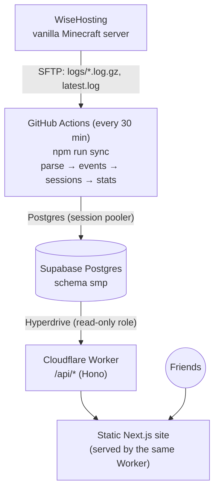

# SMP Analytics

A private analytics dashboard for our Minecraft SMP. The centrepiece is an
interactive, zoomable **activity timeline**: who was online and when. Every player
also gets a full profile with playtime, activity patterns, deaths and advancements.

It works with a **completely vanilla** server: no plugins, mods, Paper or Fabric.
All data comes from the server's own log files, read over SFTP. It runs on
**$0/month** of free-tier infrastructure.

## Architecture



- **Ingestion** (`packages/ingest`) downloads new log data and parses it into events
  in an idempotent way. It then rebuilds sessions and **precomputes all statistics**.
- **Database** (`packages/db`): events are the source of truth. Sessions and stats are
  derived from them and fully rebuilt on each sync.
- **API** (`apps/api`) is a thin Hono app. Because stats are precomputed, every request
  is a cheap lookup, which keeps it within the free Worker's 10 ms CPU budget.
- **Frontend** (`apps/web`) is Next.js exported as static files. The timeline is drawn
  on a canvas.

## Tech stack

| Area | Choice |
|---|---|
| Language | TypeScript (strict) everywhere |
| Frontend | Next.js 16 (static export), React 19, Tailwind CSS 4, custom canvas/SVG charts |
| API | Hono on Cloudflare Workers, Hyperdrive → Postgres via `postgres.js` |
| Database | Supabase PostgreSQL; PGlite (Postgres in WASM) for tests and local dev |
| Ingestion | Node 24, `ssh2-sftp-client`, run by GitHub Actions |
| Tests | Vitest (unit, integration on real Postgres via PGlite, jsdom component tests) |

## Local development

No accounts are needed. Everything runs locally against an embedded Postgres.

```bash
npm install

# 1. Import logs from a local folder into a local database (.data/dev, gitignored).
#    Put a copy of the server's logs/ folder in ./samples first.
npm run import:logs -- --dir samples

# 2. Start the API (http://localhost:8787) and the website (http://localhost:3000)
npm run dev
```

`DATABASE_URL` defaults to `pglite:.data/dev`. Point it at Supabase in `.env.local`
to use real data instead.

| Command | What it does |
|---|---|
| `npm run dev` | API + website with hot reload |
| `npm run import:logs [-- --dir <folder>]` | Historical import (SFTP by default) |
| `npm run sync [-- --reparse]` | Incremental sync, what GitHub Actions runs |
| `npm run db:migrate` | Apply schema migrations to `DATABASE_URL` |
| `npm run lint` / `typecheck` / `test` / `build` | Quality checks |
| `npm run check` | All four of the above |

## Environment variables

Documented in [`.env.example`](.env.example). None of these is ever sent to the browser.

| Variable | Used by | Secret? |
|---|---|---|
| `DATABASE_URL` | Ingester, local API | **Yes** (contains the DB password) |
| `SFTP_HOST`, `SFTP_PORT`, `SFTP_USERNAME`, `SFTP_PASSWORD` | Ingester | **Yes** |
| `SFTP_LOG_DIR` | Ingester (default `logs`) | No |
| `SERVER_LOG_TIMEZONE` | Ingester (default `UTC`) | No |
| `STATS_TIMEZONE` | Ingester (default `America/New_York`) | No |
| `API_PORT` | Local API (default `8787`) | No |
| `NEXT_PUBLIC_API_BASE_URL` | Website, dev only (`apps/web/.env.development`) | No, it's just a URL |

In production the Worker gets its database access through the **Hyperdrive binding**
in `wrangler.jsonc`. The credentials live inside Cloudflare, not in this repo.

## Deployment

See **[docs/deployment.md](docs/deployment.md)** for the step-by-step $0 setup:
- GitHub
- Supabase
- WiseHosting SFTP
- secrets
- Cloudflare
- the first import
- verification

## Documentation

- [docs/deployment.md](docs/deployment.md): deploying for $0, secrets, free-tier limits
- [docs/parser.md](docs/parser.md): log format, recognized events, session reconstruction, idempotency, what the logs can't tell us
- [docs/statistics.md](docs/statistics.md): how every stat is computed, time zones, the highlight system

## Project structure

```
apps/
  web/                 Next.js site (static export)
    src/app/           routes: / (timeline), /player/?name=, /leaderboards/
    src/components/    timeline (canvas renderer, toolbar, popover), player page, charts, UI
    src/lib/           API client, formatting, pure timeline maths (viewport, ticks, model)
  api/                 Cloudflare Worker: Hono app, Worker entry, local Node dev server
packages/
  core/                framework-free domain logic + shared API types
    parser/            tokenizer, matchers, death-message catalog
    sessions/          session reconstruction, player identity
    stats/             statistics, stat registry, highlights
    logs/ time/        log file naming/dating, timezone helpers
  db/                  migrations, Sql interface (postgres.js / PGlite), read & write queries
  ingest/              CLI + pipeline, SFTP and local-folder log sources
docs/                  deployment, parser, statistics
.github/workflows/     ci.yml, sync.yml (every 30 min), deploy.yml
```

## Troubleshooting

| Symptom | Likely cause / fix |
|---|---|
| Sync: `Missing required environment variable …` | A secret isn't set (Settings → Secrets → Actions) |
| Sync: `All configured authentication methods failed` | Wrong SFTP username/password. The username often includes a server id (`name.abcd1234`) |
| Sync: `ETIMEDOUT` / `ECONNREFUSED` | Wrong SFTP host/port, or WiseHosting SFTP is down |
| Sync: `No such file` on list | `SFTP_LOG_DIR` is wrong. Check the folder in the panel's file manager |
| Sync: `ENOTFOUND db.<ref>.supabase.co` in Actions | You used the direct DB string. Use the **session pooler** string for `DATABASE_URL` |
| Site loads but "API unreachable" | Hyperdrive id not set in `wrangler.jsonc`, or wrong reader password. Check `/api/meta` |
| Parse issues appear after a Minecraft update | New death message or format. Add a template/matcher, then run sync with `--reparse` |
| Sync workflow stopped running | GitHub's 60-day inactivity rule. Actions → Sync server logs → Enable workflow |
| Supabase "project paused" | No syncs for 7 days. Restore it in the dashboard, then fix the sync |
| Times look shifted by hours | `SERVER_LOG_TIMEZONE` doesn't match the server's clock |

## Maintenance

- **Minecraft updates:** check `smp.parse_issues` after the first sync on the new
  version. New death messages go in `packages/core/src/parser/death-messages.ts`, and
  other format changes in `matchers.ts`. Then run the Sync workflow with **reparse**.
- **WiseHosting credentials change:** update the `SFTP_*` secrets.
- **GitHub Actions fails:** open the failed run. The error is printed plainly
  (credentials are masked). Re-run once it's fixed; syncs are idempotent.
- **Supabase changes** (password reset, new project): update `DATABASE_URL`, and the
  Hyperdrive config (`npx wrangler hyperdrive update <id> --connection-string=…`).
- **New players:** nothing to do. They appear after their first session, with the
  next free colour.
